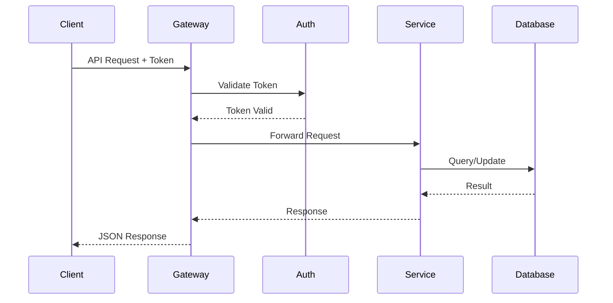
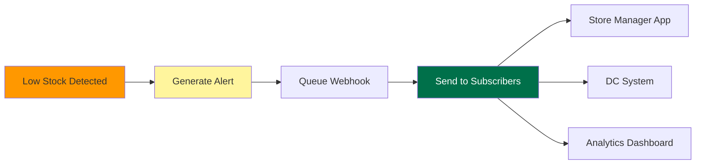
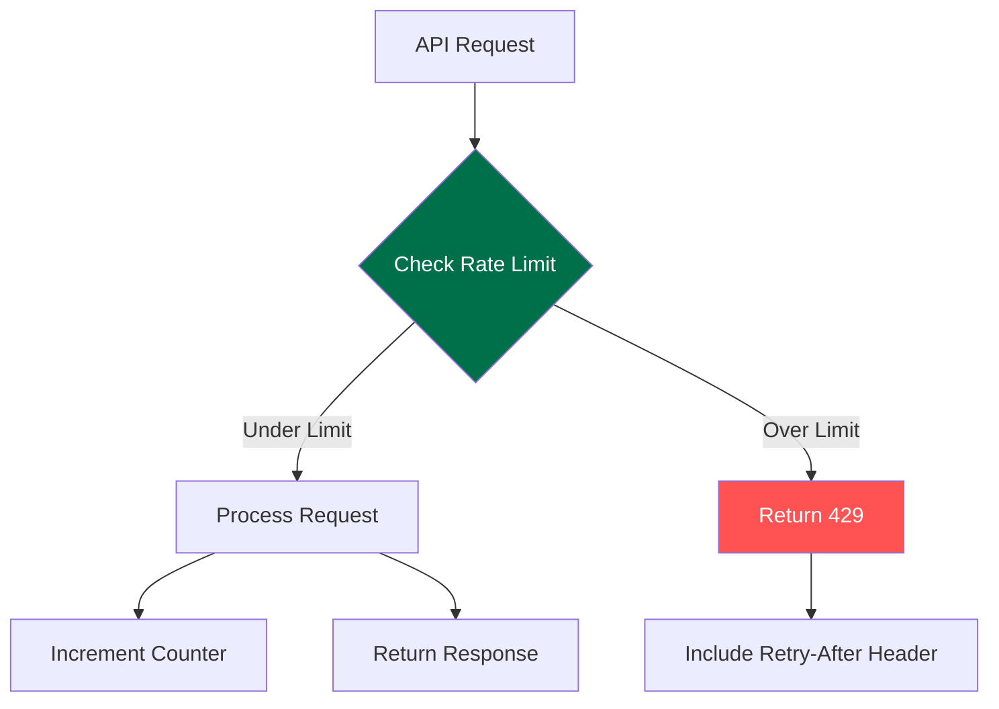

# API Specifications
## Starbucks Real-Time Inventory Management System (RTIMS)

**Version:** 1.0.0  
**Base URL:** `https://api.starbucks-rtims.com/v1`  
**Authentication:** OAuth 2.0 with JWT tokens

---

## API Flow Overview



---

## Authentication Endpoints

### POST /auth/login
Authenticate user and receive access token

**Request Body:**
```json
{
  "email": "string",
  "password": "string",
  "storeId": "string (optional for store-specific login)"
}
```

**Response 200:**
```json
{
  "accessToken": "string",
  "refreshToken": "string",
  "expiresIn": 3600,
  "tokenType": "Bearer",
  "user": {
    "id": "string",
    "email": "string",
    "role": "string",
    "permissions": ["string"]
  }
}
```

### POST /auth/refresh
Refresh access token

**Request Body:**
```json
{
  "refreshToken": "string"
}
```

**Response 200:**
```json
{
  "accessToken": "string",
  "expiresIn": 3600
}
```

---

## Inventory Management Endpoints

### GET /inventory/stores/{storeId}
Get real-time inventory for a specific store

**Path Parameters:**
- `storeId` (string, required): Store identifier

**Query Parameters:**
- `category` (string, optional): Filter by product category
- `lowStock` (boolean, optional): Only return items below threshold
- `includeMetrics` (boolean, optional): Include AI predictions

**Response 200:**
```json
{
  "storeId": "string",
  "lastUpdated": "2025-05-26T10:30:00Z",
  "items": [
    {
      "sku": "string",
      "name": "string",
      "category": "string",
      "currentQuantity": 150,
      "threshold": {
        "minimum": 20,
        "optimal": 50,
        "maximum": 100,
        "confidence": 0.92
      },
      "predictedDemand": {
        "next24Hours": 45,
        "next7Days": 280,
        "accuracy": 0.87
      },
      "shelfLife": {
        "averageRemaining": 48,
        "expiringToday": 5,
        "expiringTomorrow": 12
      }
    }
  ],
  "alerts": [
    {
      "type": "LOW_STOCK",
      "sku": "string",
      "severity": "HIGH",
      "message": "Croissants below minimum threshold",
      "actionRequired": "REORDER"
    }
  ]
}
```

### POST /inventory/items/track
Track individual item (scan event)

**Request Body:**
```json
{
  "itemId": "string (UUID)",
  "action": "PRODUCED|SHIPPED|RECEIVED|SOLD|WASTED",
  "location": {
    "type": "STORE|DC|TRANSIT",
    "id": "string"
  },
  "timestamp": "2025-05-26T10:30:00Z",
  "metadata": {
    "temperature": 4.5,
    "scannedBy": "string (userId)",
    "posTransactionId": "string (optional)"
  }
}
```

**Response 201:**
```json
{
  "trackingId": "string",
  "itemId": "string",
  "blockchainTxHash": "string",
  "status": "CONFIRMED",
  "timestamp": "2025-05-26T10:30:00Z"
}
```

### PUT /inventory/thresholds
Update inventory thresholds (manual override)

**Request Body:**
```json
{
  "storeId": "string",
  "adjustments": [
    {
      "sku": "string",
      "threshold": {
        "minimum": 25,
        "optimal": 60,
        "maximum": 120
      },
      "reason": "SEASONAL_ADJUSTMENT|MANUAL_OVERRIDE|EVENT_BASED",
      "expiresAt": "2025-06-01T00:00:00Z (optional)"
    }
  ]
}
```

**Response 200:**
```json
{
  "updated": 3,
  "adjustments": [
    {
      "sku": "string",
      "previousThreshold": {...},
      "newThreshold": {...},
      "aiRecommendation": {...}
    }
  ]
}
```

---

## Supply Chain Endpoints

### GET /supply-chain/orders/{orderId}
Get order details and tracking

**Response 200:**
```json
{
  "orderId": "string",
  "status": "PENDING|CONFIRMED|IN_TRANSIT|DELIVERED",
  "createdAt": "2025-05-26T08:00:00Z",
  "estimatedDelivery": "2025-05-27T06:00:00Z",
  "items": [
    {
      "sku": "string",
      "quantity": 100,
      "unitCost": 2.50,
      "expirationDate": "2025-05-30T00:00:00Z"
    }
  ],
  "route": {
    "dcId": "string",
    "storeId": "string",
    "distance": 45.2,
    "estimatedTime": 90,
    "driver": "string"
  },
  "blockchainTracking": [
    {
      "event": "ORDER_CREATED",
      "timestamp": "2025-05-26T08:00:00Z",
      "txHash": "string"
    }
  ]
}
```

### POST /supply-chain/orders
Create new inventory order

**Request Body:**
```json
{
  "storeId": "string",
  "type": "AUTOMATIC|MANUAL|EMERGENCY",
  "items": [
    {
      "sku": "string",
      "quantity": 100,
      "urgency": "NORMAL|HIGH|CRITICAL"
    }
  ],
  "deliveryWindow": {
    "earliest": "2025-05-27T05:00:00Z",
    "latest": "2025-05-27T10:00:00Z"
  }
}
```

---

## Analytics Endpoints

### GET /analytics/predictions/{storeId}
Get AI predictions for store

**Query Parameters:**
- `timeframe` (string): "24h|7d|30d"
- `metrics` (array): ["demand","waste","stockout"]

**Response 200:**
```json
{
  "storeId": "string",
  "predictions": {
    "demand": {
      "timeframe": "7d",
      "items": [
        {
          "sku": "string",
          "predictedQuantity": 450,
          "confidence": 0.89,
          "factors": {
            "weather": 0.15,
            "seasonality": 0.30,
            "events": 0.05,
            "historical": 0.50
          }
        }
      ]
    },
    "waste": {
      "estimatedItems": 23,
      "estimatedValue": 145.67,
      "topRiskItems": ["sku1", "sku2"]
    }
  }
}
```

### GET /analytics/performance
Get system performance metrics

**Response 200:**
```json
{
  "metrics": {
    "inventoryAccuracy": 0.992,
    "stockoutReduction": 0.87,
    "wasteReduction": 0.15,
    "forecastAccuracy": 0.86
  },
  "systemHealth": {
    "uptime": 0.9995,
    "avgLatency": 87,
    "transactionsProcessed": 12450000
  }
}
```

---

## Webhook Events

### Inventory Alert Webhook
**Event:** `inventory.alert`



**Payload:**
```json
{
  "eventId": "string",
  "timestamp": "2025-05-26T10:30:00Z",
  "type": "inventory.alert",
  "data": {
    "storeId": "string",
    "alertType": "LOW_STOCK|EXPIRING|STOCKOUT",
    "items": [
      {
        "sku": "string",
        "currentQuantity": 5,
        "threshold": 20,
        "action": "REORDER_SUGGESTED"
      }
    ]
  }
}
```

### Transaction Completed Webhook
**Event:** `transaction.completed`
**Payload:**
```json
{
  "eventId": "string",
  "timestamp": "2025-05-26T10:30:00Z",
  "type": "transaction.completed",
  "data": {
    "transactionId": "string",
    "storeId": "string",
    "items": [
      {
        "itemId": "string",
        "sku": "string",
        "price": 4.95
      }
    ],
    "blockchainTxHash": "string"
  }
}
```

---

## Error Responses

All endpoints follow consistent error response format:

**Error Response:**
```json
{
  "error": {
    "code": "INVALID_REQUEST|UNAUTHORIZED|NOT_FOUND|CONFLICT|INTERNAL_ERROR",
    "message": "Human-readable error message",
    "details": {
      "field": "Additional context"
    },
    "requestId": "string",
    "timestamp": "2025-05-26T10:30:00Z"
  }
}
```

**HTTP Status Codes:**
- 200: Success
- 201: Created
- 400: Bad Request
- 401: Unauthorized
- 403: Forbidden
- 404: Not Found
- 409: Conflict
- 429: Rate Limited
- 500: Internal Server Error

---

## Rate Limiting



**Rate Limits by Endpoint Type:**
- Authentication: 10 requests per minute
- Read Operations: 1000 requests per minute
- Write Operations: 100 requests per minute
- Analytics: 50 requests per minute

**Headers:**
- `X-RateLimit-Limit`: Request limit per window
- `X-RateLimit-Remaining`: Remaining requests in window
- `X-RateLimit-Reset`: Window reset timestamp

---

*End of API Specification*