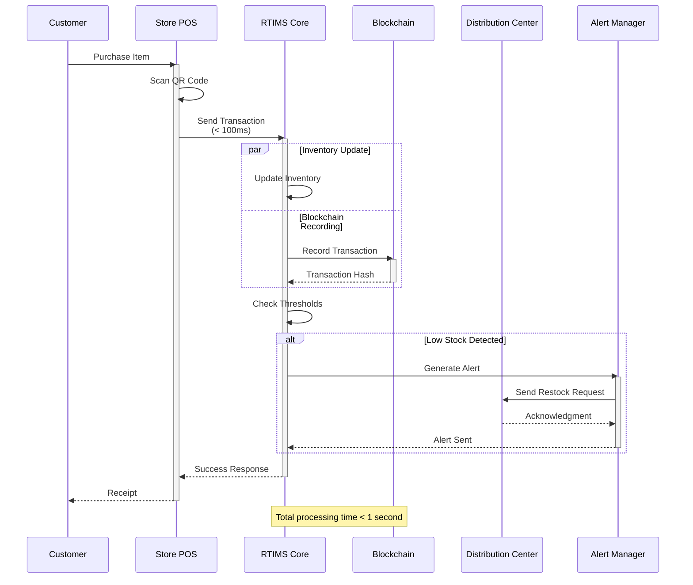
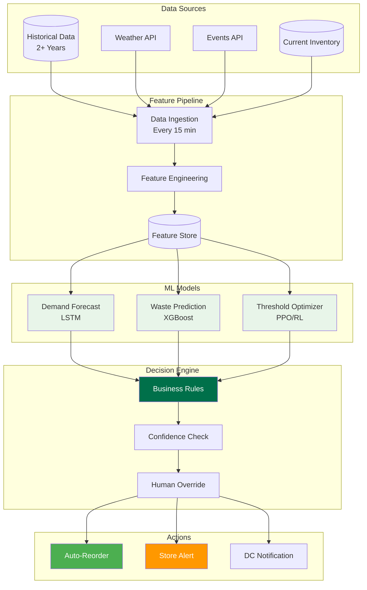
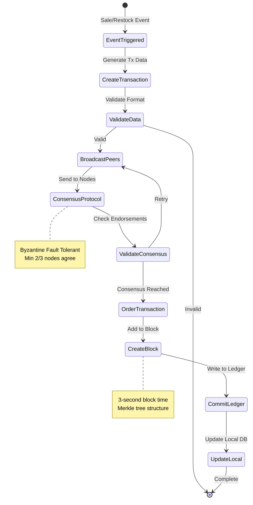
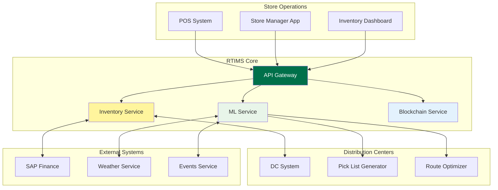
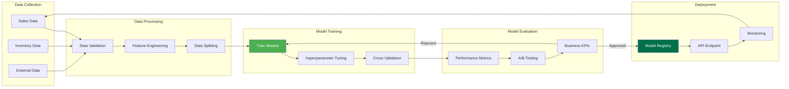
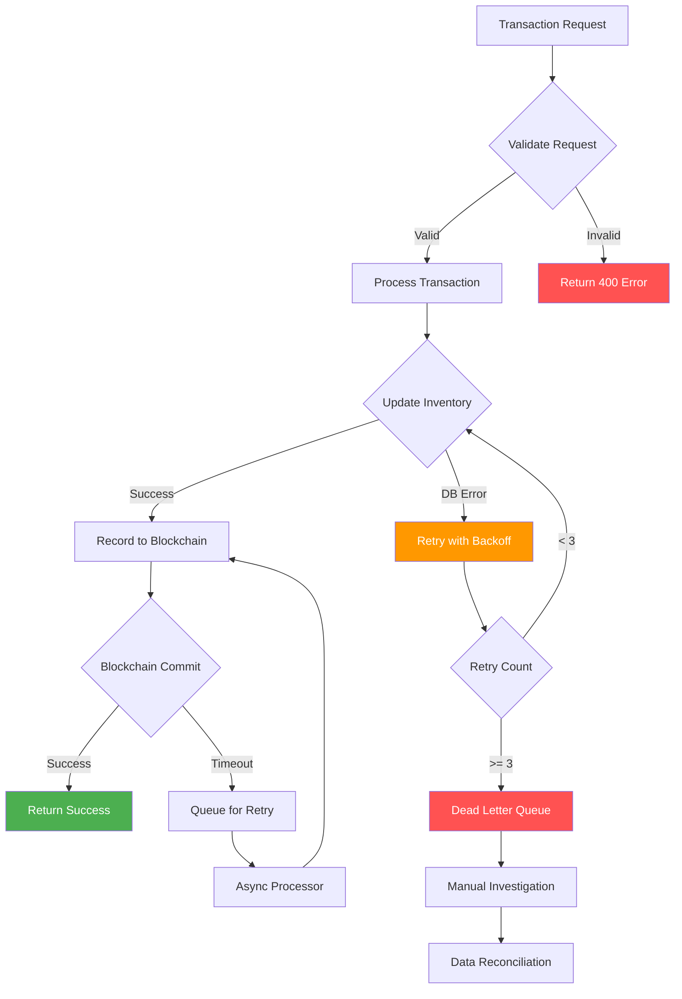
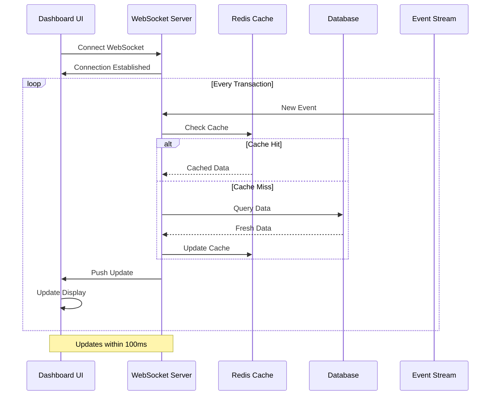
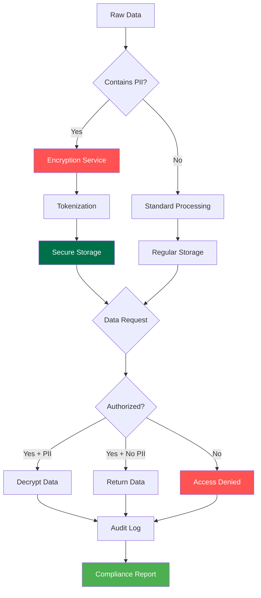
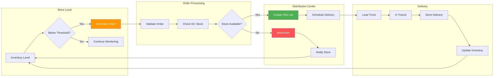
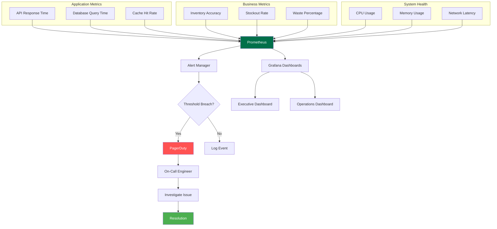

# Data Flow Diagrams
## Starbucks Real-Time Inventory Management System (RTIMS)

---

## 1. Real-Time Sales Transaction Flow

---

## 2. AI-Driven Restock Flow

---

## 3. Blockchain Transaction Flow

---

## 4. Supply Chain Integration Flow

---

## 5. ML Model Training Pipeline

---

## 6. Error Handling and Recovery Flow

---

## 7. Real-Time Dashboard Update Flow

---

## 8. Data Privacy and Compliance Flow

---

## 9. Store-to-DC Communication Flow

---

## 10. Performance Monitoring Flow

---

*End of Data Flow Diagrams*