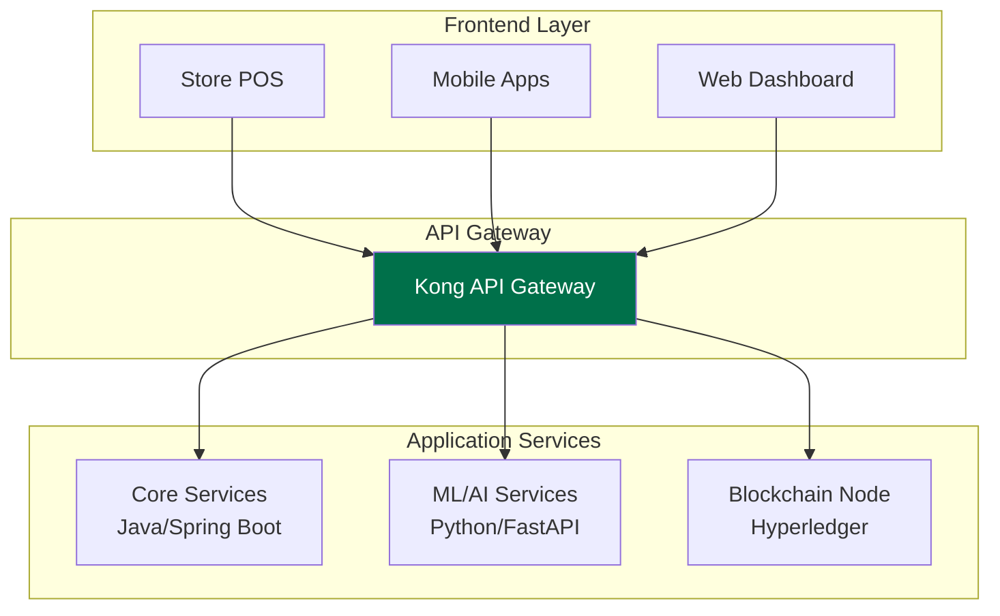
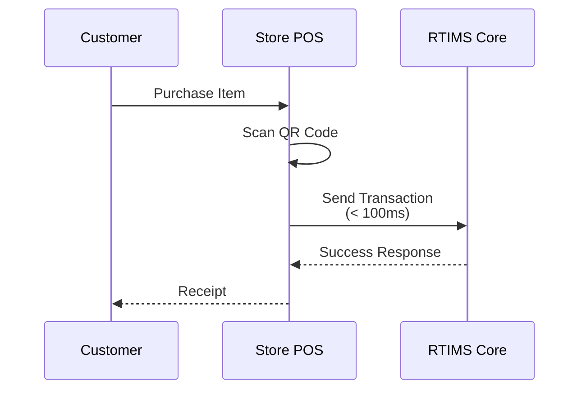
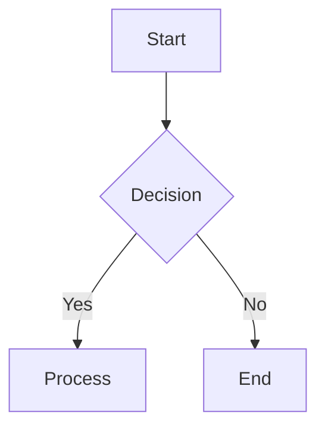
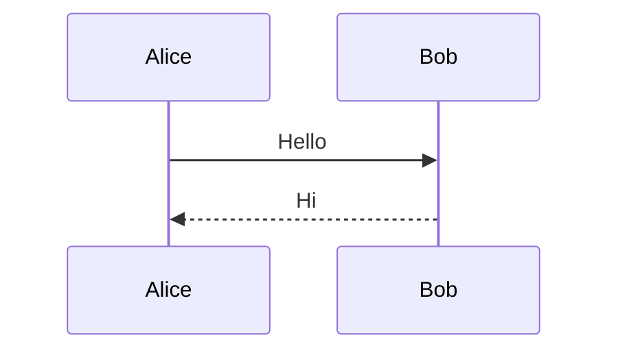
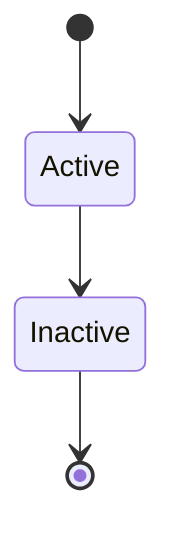
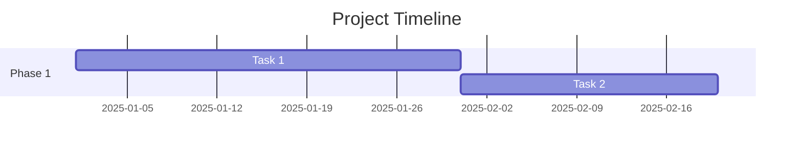
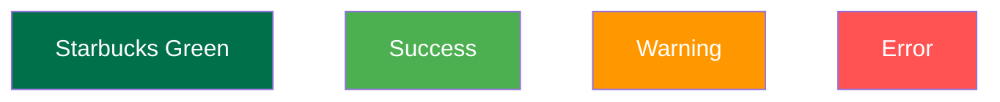

# Diagram Conversion Examples
## From ASCII to Mermaid

This document shows examples of how the diagrams were converted from ASCII art to clean Mermaid format.

---

## Example 1: System Architecture

### Before (ASCII Art):
```
┌─────────────────┐     ┌─────────────────┐     ┌─────────────────┐
│   Store POS     │     │  Mobile Apps    │     │  Web Dashboard  │
└────────┬────────┘     └────────┬────────┘     └────────┬────────┘
         │                       │                         │
         └───────────────────────┴─────────────────────────┘
                                 │
                        ┌────────▼────────┐
                        │  API Gateway    │
                        └────────┬────────┘
                                 │
```

### After (Mermaid):


---

## Example 2: Transaction Flow

### Before (ASCII Art):
```
┌─────────────┐     ┌──────────────┐     ┌─────────────┐
│   Customer  │     │  Store POS   │     │   RTIMS     │
└──────┬──────┘     └──────┬───────┘     └──────┬──────┘
       │                   │                     │
       │  Purchase Item    │                     │
       ├──────────────────>│                     │
       │                   │                     │
       │                   │  Scan QR Code       │
       │                   ├────────────────────>│
```

### After (Mermaid):


---

## Benefits of Mermaid Diagrams

### 1. **Readability**
- Clear, professional appearance
- Consistent styling
- Easy to understand flow

### 2. **Maintainability**
- Text-based format
- Version control friendly
- Easy to update

### 3. **Flexibility**
- Multiple diagram types
- Customizable styling
- Export to various formats

### 4. **Integration**
- Works with GitHub/GitLab
- VS Code preview support
- Documentation tool compatibility

---

## Mermaid Syntax Quick Reference

### Flowchart


### Sequence Diagram


### State Diagram


### Gantt Chart


---

## Styling with Mermaid

### Brand Colors


### Custom Themes
Mermaid supports custom themes and styling to match brand guidelines:
- Starbucks Green: `#00704A`
- Light Green: `#e8f5e9`
- Warning Orange: `#ff9800`
- Error Red: `#ff5252`

---

*All diagrams in the RTIMS documentation have been converted to this clean, maintainable format.*