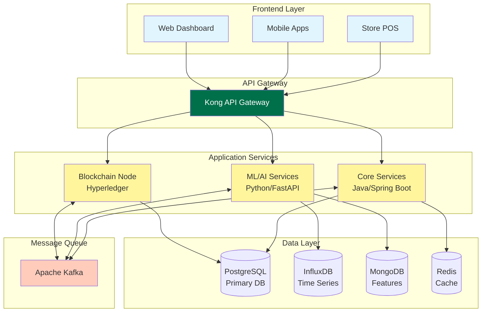
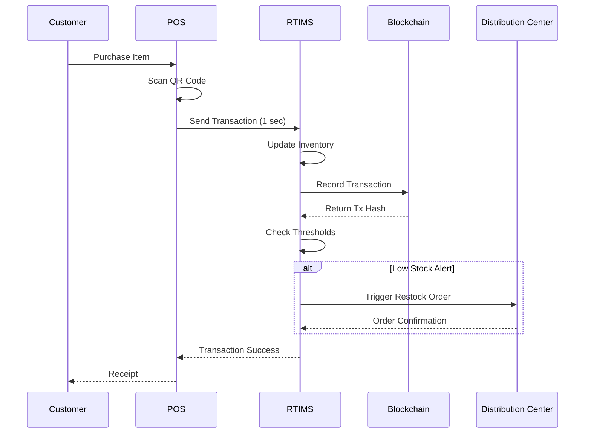
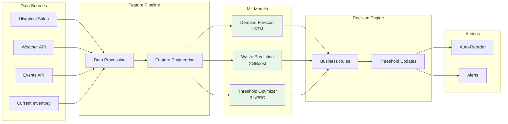
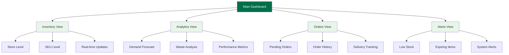
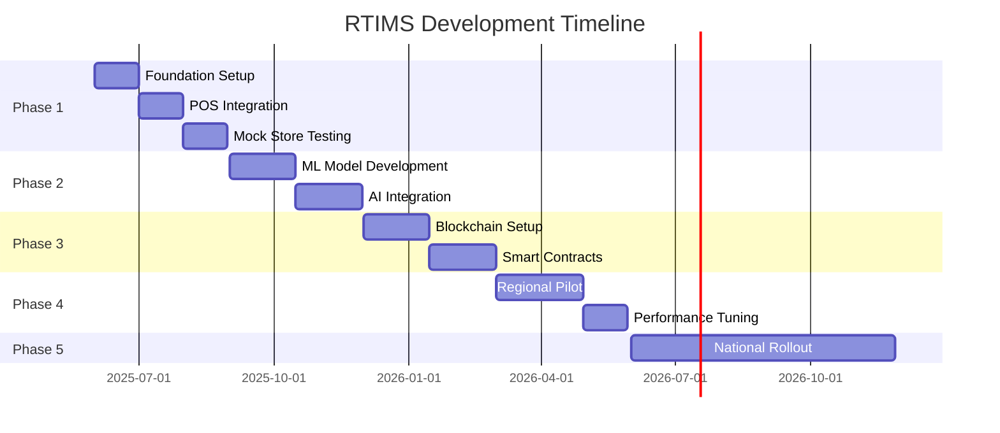
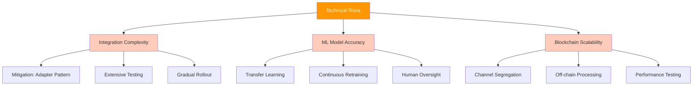

### 4.4 Predictive Analytics Suite
**Description:** Advanced analytics for waste reduction and demand optimization

**Core Algorithms:**
- Demand Forecasting: LSTM neural networks with attention mechanisms
- Waste Prediction: Gradient boosting with shelf-life features
- Route Optimization: Modified VRP with time windows
- Quality Prediction: Random forest with sensor data integration

**Acceptance Criteria:**
- Forecast accuracy within 10% margin of error
- Waste predictions 24-48 hours in advance
- Route optimization reduces delivery time by 15%
- Dashboard updates every 15 minutes

### 4.5 Multi-Platform User Interfaces
**Description:** Responsive web and native mobile applications

**Technical Specifications:**
- Frontend: React 18+ with TypeScript
- Mobile: React Native for iOS/Android
- State Management: Redux Toolkit with RTK Query
- UI Component Library: Custom design system
- Real-time updates: WebSocket connections

**Key Screens:**
- Real-time inventory dashboard
- Predictive analytics view
- Order management interface
- Alert and notification center
- Historical reporting tools

---

## 5. Technical Architecture and Stack

### 5.1 Recommended Technology Stack

**Backend Services:**
- Language: Java 17+ (Spring Boot 3.x) for core services
- Python 3.11+ for ML/AI services
- Message Queue: Apache Kafka
- Cache: Redis Cluster
- Search: Elasticsearch

**Databases:**
- Primary: PostgreSQL 15+ with partitioning
- Time-series: InfluxDB for metrics
- Document Store: MongoDB for unstructured data
- Blockchain: Hyperledger Fabric 2.5+

**Infrastructure:**
- Cloud: AWS (primary) with multi-region deployment
- Container Orchestration: Kubernetes (EKS)
- Service Mesh: Istio
- API Gateway: Kong or AWS API Gateway

**Security Stack:**
- Identity Provider: Okta or Auth0
- Secrets Management: HashiCorp Vault
- Encryption: AES-256 for data at rest, TLS 1.3 for transit

### 5.2 System Architecture Diagram



---

## 6. Data Model and System Design

### 6.1 Core Entities

**Item Entity**
```javascript
{
  itemId: string (UUID),
  sku: string,
  name: string,
  category: string,
  productionDate: timestamp,
  expirationDate: timestamp,
  currentLocation: string,
  status: enum ['produced', 'in_transit', 'in_store', 'sold', 'wasted'],
  qualityMetrics: {
    temperature: number[],
    humidity: number[]
  },
  blockchainTxHash: string
}
```

**Store Inventory Entity**
```javascript
{
  storeId: string,
  itemCounts: Map<sku, quantity>,
  thresholds: Map<sku, {
    minimum: number,
    optimal: number,
    maximum: number,
    confidence: float
  }>,
  lastUpdated: timestamp,
  pendingOrders: Order[]
}
```

**ML Feature Store Entity**
```javascript
{
  storeId: string,
  sku: string,
  features: {
    avgDailySales: number,
    seasonalityIndex: float,
    weatherImpact: float,
    eventProximity: float,
    dayOfWeekPattern: number[],
    shelfLifeRemaining: number
  },
  lastCalculated: timestamp
}
```

### 6.2 Data Flow Architecture



---

## 7. Security and Compliance Requirements

### 7.1 Security Standards
- **SOC 2 Type II Compliance:** Annual audit requirement
- **PCI DSS Level 1:** For payment data integration
- **Food Safety Compliance:** FDA Food Safety Modernization Act
- **Data Privacy:** CCPA, GDPR compliance for international operations

### 7.2 Security Implementation
- **Encryption:** AES-256 at rest, TLS 1.3 in transit
- **Authentication:** Multi-factor authentication for all users
- **Authorization:** Role-based access control (RBAC)
- **Audit Logging:** Complete audit trail with blockchain integration
- **Vulnerability Management:** Monthly security scans, quarterly penetration testing

---

## 8. AI/ML Capabilities

### 8.1 Demand Forecasting Model
**Architecture:** LSTM with attention mechanisms
**Input Features:**
- Historical sales (2 years minimum)
- Weather data (temperature, precipitation, forecast)
- Local events calendar
- Store location demographics
- Day/time patterns
- Holiday calendar

**Output:** 7-day hourly demand forecast per SKU per store

### 8.2 Dynamic Threshold Optimization
**Architecture:** Reinforcement Learning (PPO algorithm)
**Objective Function:** Minimize (stockout_cost + waste_cost + holding_cost)
**Action Space:** Threshold adjustments per SKU
**State Space:** Current inventory, forecasted demand, shelf life

### 8.3 ML Pipeline Architecture



### 8.4 Waste Prediction Model
**Architecture:** XGBoost with custom loss function
**Features:**
- Current inventory levels
- Remaining shelf life
- Historical waste patterns
- Upcoming demand forecast
- Temperature excursions

**Output:** Probability of waste within 24/48 hours

### 8.5 Route Optimization
**Algorithm:** Modified Vehicle Routing Problem with Time Windows
**Constraints:**
- Delivery time windows
- Vehicle capacity
- Driver hours regulations
- Traffic patterns

**Output:** Optimized delivery routes reducing time by 15%+

---

## 9. Integration Requirements

### 9.1 POS System Integration
- **Protocol:** REST API with webhook notifications
- **Data Format:** JSON with Avro schema registry
- **Latency:** <100ms for transaction updates
- **Backward Compatibility:** Support legacy XML format during transition

### 9.2 Financial System Integration
- **System:** SAP integration via middleware
- **Sync Frequency:** Real-time for transactions, batch for reconciliation
- **Data Elements:** Cost centers, GL codes, inventory valuation

### 9.3 External Integrations (Future Phase)
- Weather API (NOAA or Weather.com)
- Event APIs (Ticketmaster, local event systems)
- Traffic APIs (Google Maps, HERE)

---

## 10. User Interface Design Principles

### 10.1 Design System Requirements
- **Accessibility:** WCAG 2.1 AA compliance
- **Responsive Design:** Mobile-first approach
- **Brand Consistency:** Starbucks design language
- **Performance:** <3 second page load time

### 10.2 Key UI Components
- Real-time data visualization (D3.js or Chart.js)
- Alert system with priority levels
- Drag-and-drop order management
- Interactive forecasting tools
- Mobile barcode scanning interface

### 10.3 Dashboard Information Architecture



---

## 11. Hardware and Infrastructure

### 11.1 Tracking Technology Choice
Based on cost-effectiveness analysis, **QR codes** are recommended over RFID:
- Cost: $0.01-0.05 per label vs $0.10-1.00 for RFID
- Implementation: Uses existing smartphone cameras
- Reliability: 99.9% scan success rate
- No special hardware required at stores

### 11.2 Infrastructure Requirements
- **Data Centers:** AWS us-east-1 (primary), us-west-2 (DR)
- **CDN:** CloudFront for static assets
- **Monitoring:** Datadog or New Relic
- **Backup:** Daily snapshots, 30-day retention

---

## 12. Development Phases and Milestones

### Phase 1: Foundation (Months 1-3)
- Core infrastructure setup
- Basic inventory tracking
- POS integration prototype
- Mock store testing
- **Deliverable:** Working prototype with 5 pilot stores

### Phase 2: AI/ML Integration (Months 4-6)
- Demand forecasting models
- Dynamic threshold system
- Historical data ingestion
- Model training pipeline
- **Deliverable:** AI-powered system in 50 stores

### Phase 3: Blockchain Implementation (Months 7-9)
- Hyperledger Fabric setup
- Smart contract development
- Supply chain partner onboarding
- Security audit
- **Deliverable:** Blockchain-enabled tracking in 200 stores

### Phase 4: Regional Rollout (Months 10-12)
- Scale to 1,000 stores
- Performance optimization
- User training programs
- Feedback incorporation
- **Deliverable:** Full regional deployment

### Phase 5: National Deployment (Months 13-18)
- Progressive rollout to all 17,000 stores
- 24/7 support establishment
- Continuous improvement cycle
- **Deliverable:** Complete system replacement

### Development Timeline Visualization



---

## 13. Success Metrics and KPIs

### 13.1 Technical KPIs
- System uptime: >99.95%
- Transaction latency: <100ms average
- Forecast accuracy: >85%
- API response time: <200ms p99

### 13.2 Business KPIs
- Stockout reduction: 90%
- Food waste reduction: 15%
- Revenue increase: 8-12%
- ROI achievement: <18 months

### 13.3 User Adoption Metrics
- Daily active users: >80% of store managers
- Mobile app usage: >60% of transactions
- Training completion: 100% before go-live
- User satisfaction: >4.5/5.0

---

## 14. Risk Analysis and Mitigation

### 14.1 Technical Risks



### 14.2 Business Risks
**Risk:** User adoption resistance
- **Mitigation:** Comprehensive training, change management, incentive programs

**Risk:** Data quality issues during migration
- **Mitigation:** Data validation frameworks, reconciliation processes

---

## 15. Cost Optimization Strategies

### 15.1 Infrastructure Optimization
- Auto-scaling for 40% cost reduction during off-hours
- Reserved instances for predictable workloads
- Spot instances for batch processing
- Data lifecycle management with tiered storage

### 15.2 Operational Optimization
- Automated testing reducing QA costs by 60%
- Self-service analytics reducing support tickets
- Predictive maintenance preventing downtime
- Open-source alternatives where appropriate

---

## 16. Future Expansion Possibilities

### 16.1 Additional Features (Post-Launch)
- Customer demand prediction based on app pre-orders
- Dynamic pricing integration
- Supplier quality scoring
- Carbon footprint tracking
- Automated reordering with suppliers
- Predictive equipment maintenance

### 16.2 Platform Extensions
- Integration with customer mobile app
- Third-party marketplace for suppliers
- API platform for partner integrations
- International expansion capabilities
- Multi-tenant SaaS offering for other retailers

### 16.3 Advanced Analytics
- Customer behavior analysis
- Store performance optimization
- Network effect analysis
- Competitive intelligence integration
- Economic indicator correlation

---

## Appendix A: Technical Specifications

### API Design Guidelines
- RESTful design with OpenAPI 3.0 documentation
- GraphQL for complex queries
- gRPC for internal microservices
- Event-driven architecture with CloudEvents standard

### Development Standards
- Code coverage: >80%
- Performance testing: All endpoints
- Security scanning: Every commit
- Documentation: API-first approach

---

## Appendix B: Glossary

- **RTIMS:** Real-Time Inventory Management System
- **SKU:** Stock Keeping Unit
- **DC:** Distribution Center
- **ML:** Machine Learning
- **LSTM:** Long Short-Term Memory (neural network type)
- **PPO:** Proximal Policy Optimization
- **VRP:** Vehicle Routing Problem
- **WCAG:** Web Content Accessibility Guidelines

---

*End of Document*