# System Architecture Document
## Starbucks Real-Time Inventory Management System (RTIMS)

---

## 1. High-Level Architecture Overview

### 1.1 System Components

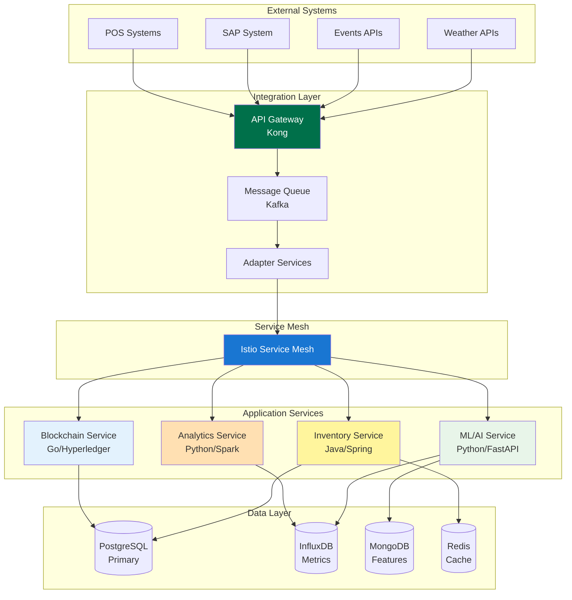

### 1.2 Deployment Architecture

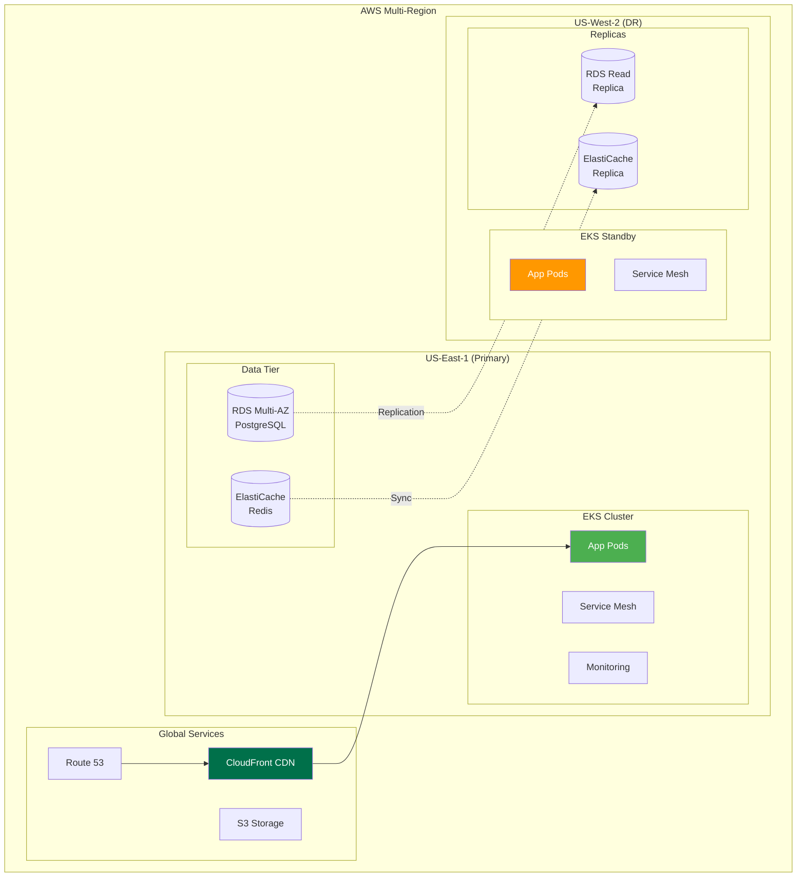

---

## 2. Microservices Architecture

### 2.1 Service Interaction Map

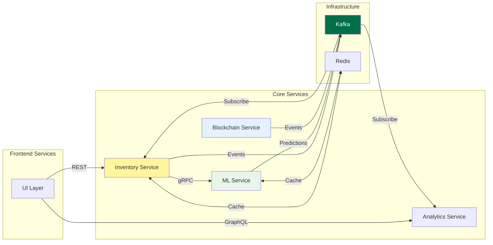

### 2.2 Service Details

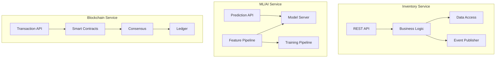

---

## 3. Security Architecture

### 3.1 Security Layers

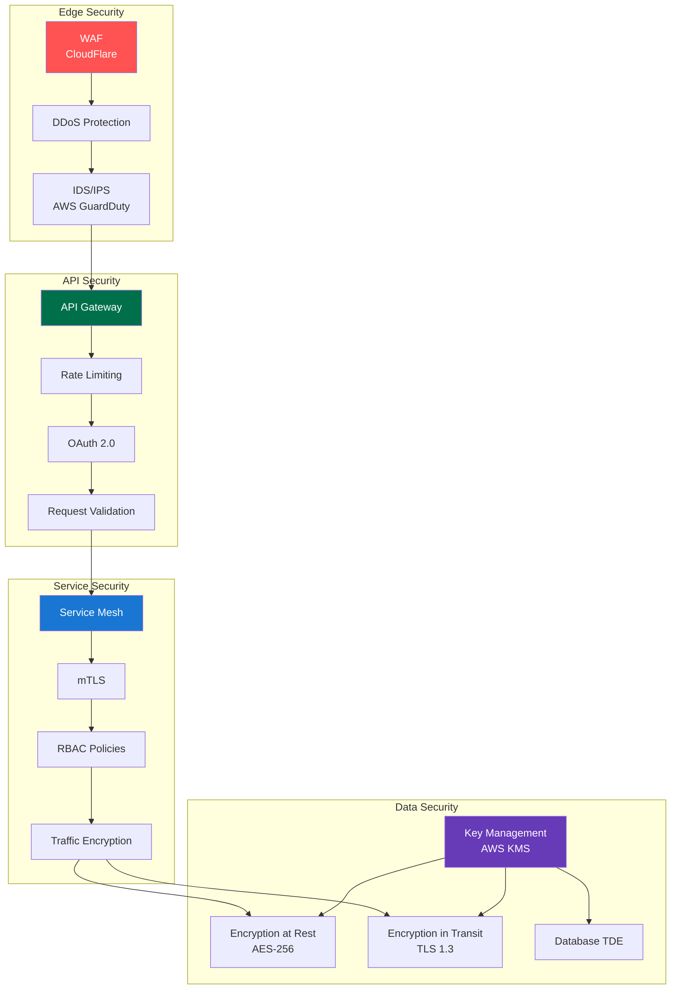

### 3.2 Authentication Flow

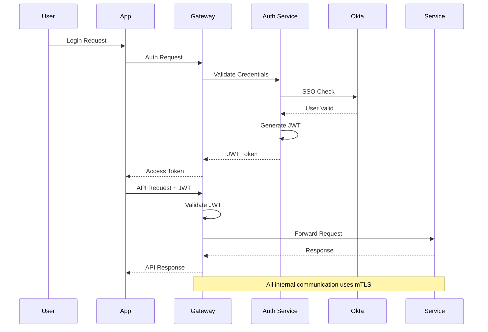

---

## 4. Data Architecture

### 4.1 Data Flow Architecture

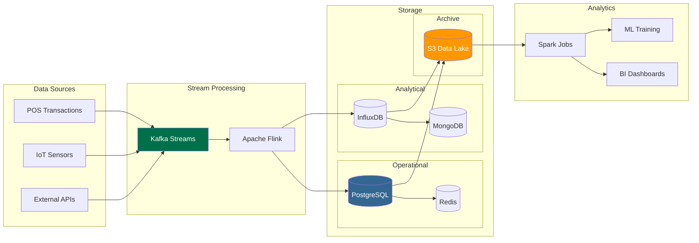

### 4.2 Database Partitioning Strategy

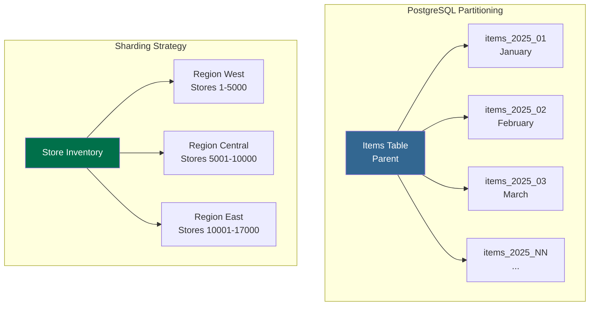

---

## 5. Performance Architecture

### 5.1 Caching Strategy

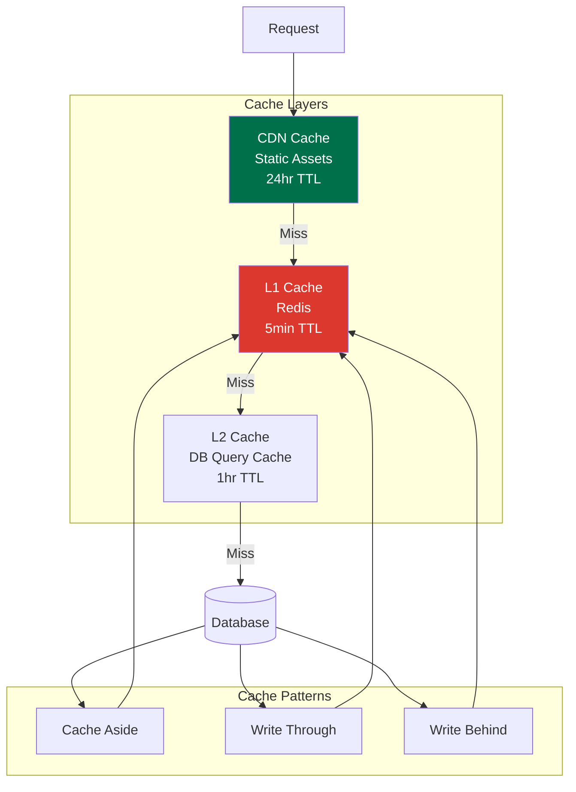

### 5.2 Load Balancing Architecture

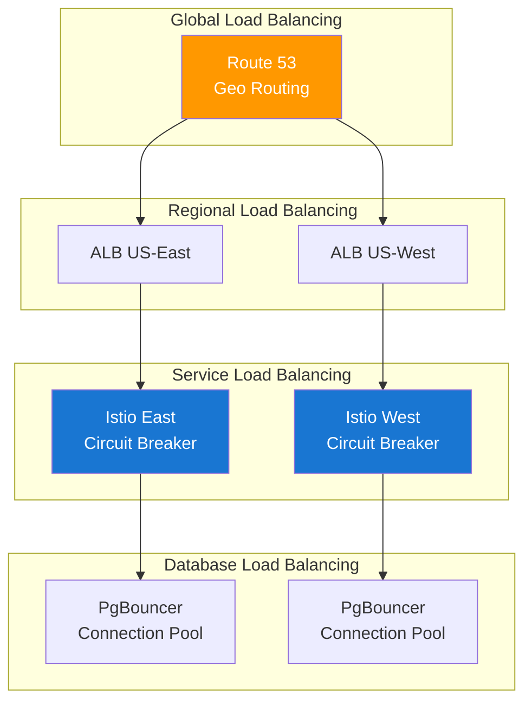

---

## 6. Monitoring and Observability

### 6.1 Monitoring Stack

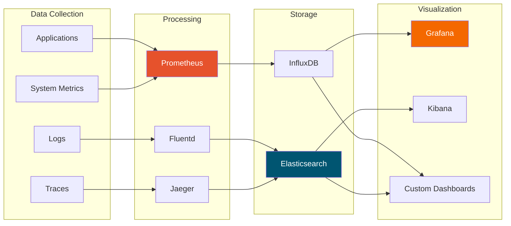

### 6.2 Alert Flow

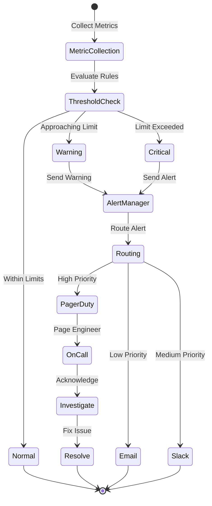

---

## 7. Disaster Recovery Architecture

### 7.1 Backup Strategy

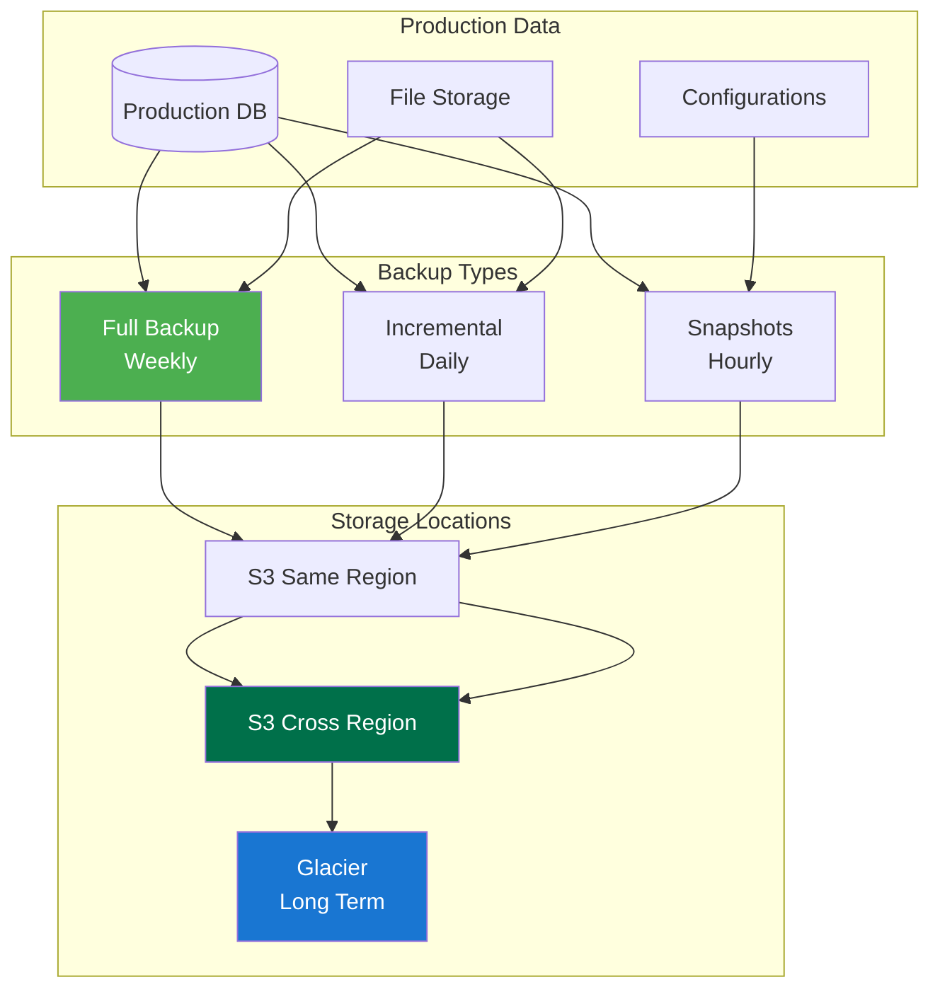

### 7.2 Failover Process

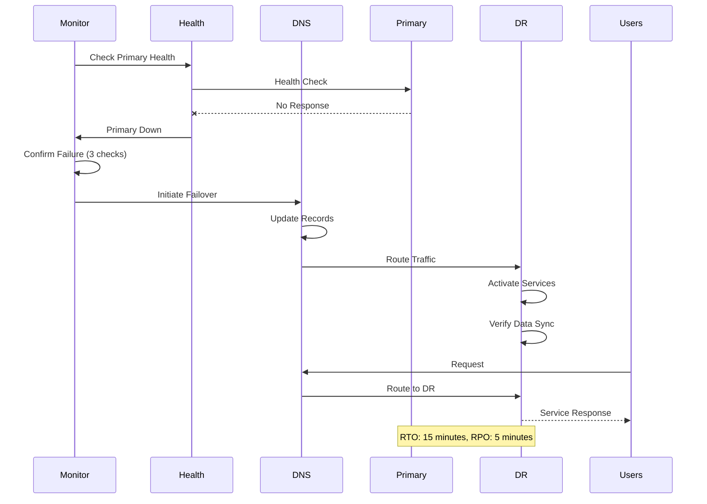

---

*End of System Architecture Document*